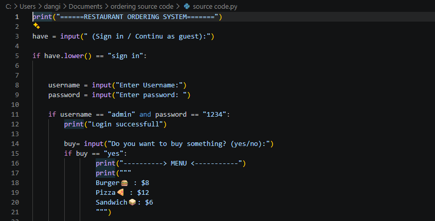
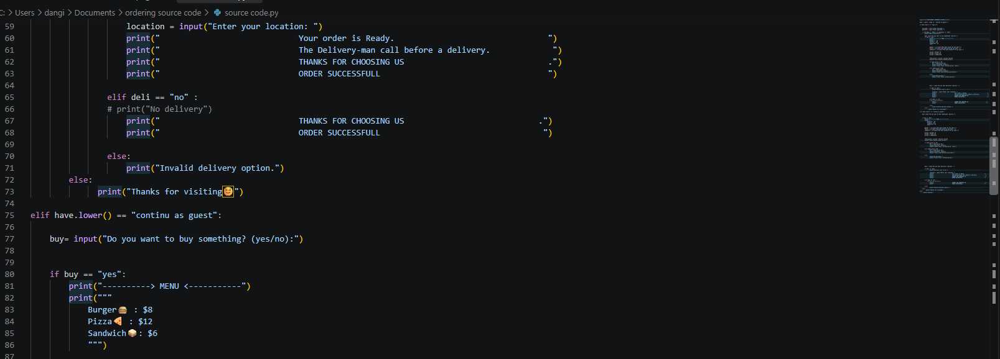

# Restaurant Ordering System

A Python-based restaurant ordering system.

## Features
- User Login
- Food Menu
- Order System
- Bill Calculation
- Delivery option 

## Technologies
- Python

## Demo
See the demo photo above.

## Source Code
Source code is not publicly available.